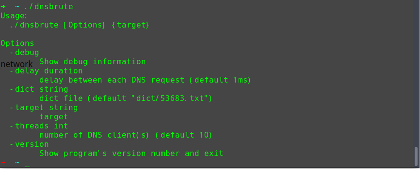

## DNSBrute

### Usage

1. Install golang on your machine. ( You can get it from [here](https://golang.org/doc/install).
2. Then, you may have to create your workspace directory, by simply `export GOPATH="$HOME/golang"`. [More info about setting GOPATH](https://github.com/golang/go/wiki/SettingGOPATH)
3.  If you have setup your GOPATH correctly, then:
```
go get github.com/grt1st/dnsbrute
go build github.com/grt1st/dnsbrute
```
Or, you can build it from [chuhades/dnsbrute](https://github.com/chuhades/dnsbrute):
```
go get github.com/chuhades/dnsbrute
go build github.com/chuhades/dnsbrute
```
4. If it works, run `./dnsbrute` to begin to use.

### Feature
- query over api
    - http://www.hackertarget.com/
    - http://ptrarchive.com/
    - ...

- dict based

###  Advantage
- Fast: 5000~10000+ domains /sec, depending on the network

- Pan-DNS identification

### Screenshot


